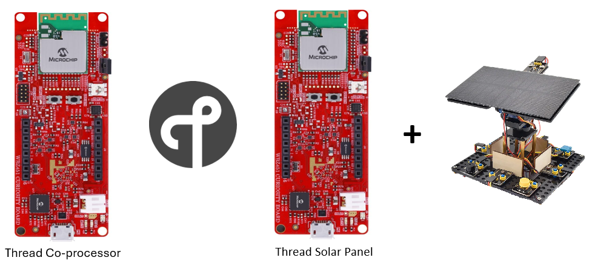
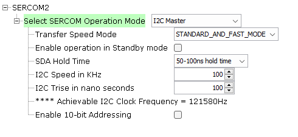
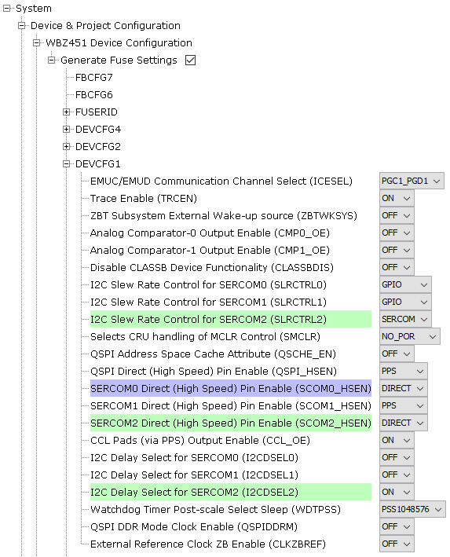

# PIC32CXBZ2_WBZ45x THREAD SOLAR PANEL DEMO

> "IoT Made Easy!" 

Devices: **| PIC32CXBZ2 | WBZ45x |** 
Features: **| THREAD |**

## ⚠ Disclaimer

<b>
THE SOFTWARE ARE PROVIDED "AS IS" AND GIVE A PATH FOR SELF-SUPPORT AND SELF-MAINTENANCE. This repository contains example code intended to help accelerate client product development.  

For additional Microchip repos, see: <a href="https://github.com/Microchip-MPLAB-Harmony" target="_blank">https://github.com/Microchip-MPLAB-Harmony</a>

Checkout the <a href="https://microchipsupport.force.com/s/" target="_blank">Technical support portal</a> to access our knowledge base, community forums or submit support ticket requests.

</b>

## Contents

1. [Introduction](#step1)
1. [Bill of materials](#step2)
1. [Hardware Setup](#step3)
1. [Software Setup](#step4)
1. [Harmony MCC Configuration](#step5)
1. [Board Programming](#step6)
1. [Run the demo](#step7)

## 1. Introduction<a name="step1">

This application enables the users to create a Minimal Thread Device. Thread Temperature sensor reports temperature and humidity values to the gateway with the use of Temp&Hum 13 click. The Gateway prints the reported data onto the console.

| Tip | Go through the [overview](https://onlinedocs.microchip.com/oxy/GUID-2DB248AF-C243-496D-9819-969E43CA63BC-en-US-1/GUID-162D7BE7-3A35-4D12-AE09-EE84C6554377.html) for understanding few key Thread protocol concepts |
| :- | :- |

## 2. Bill of materials<a name="step2">

| TOOLS | QUANTITY |
| :- | :- |
| [PIC32CX-BZ2 and WBZ451 Curiosity Development Board](https://www.microchip.com/en-us/development-tool/EV96B94A) | 1 |
| [TEMP&HUM 13 CLICK](https://www.mikroe.com/temphum-13-click) | 1 |

## 3. Hardware Setup<a name="step3">

Connect the Temp&Hum 13 click onto the Mikro bus header of the WBZ451 Curiosity board.

## 4. Software Setup<a name="step4">

- [MPLAB X IDE ](https://www.microchip.com/en-us/tools-resources/develop/mplab-x-ide#tabs)

    - Version: 6.00
	- XC32 Compiler v4.10
	- MPLAB® Code Configurator v5.1.17
	- PIC32CX-BZ_DFP v1.0.107
	- MCC Harmony
	  - csp version: v3.18.0
	  - core version: v3.13.1
	  - bsp version: v3.17.0
	  - CMSIS-FreeRTOS: v10.4.6
	  - dev_packs: v3.18.1
	  - wolfssl version: v5.4.0
	  - crypto version: v3.8.1
	  - wireless_pic32cxbz_wbz: v1.1.0
	  - wireless_15_4_phy version: v1.1.0
	  - wireless_thread: v1.0.0
	  - openthread version : mchp_harmony_wireless_thread_v1.0.0

- Any Serial Terminal application like [TERA TERM](https://download.cnet.com/Tera-Term/3000-2094_4-75766675.html) terminal application

- [MPLAB X IPE v6.00](https://microchipdeveloper.com/ipe:installation)

## 5. Harmony MCC Configuration<a name="step5">

### Getting started with Multisensor application in WBZ451 Curiosity board 

| Tip | New users of MPLAB Code Configurator are recommended to go through the [overview](https://onlinedocs.microchip.com/pr/GUID-1F7007B8-9A46-4D03-AEED-650357BA760D-en-US-6/index.html?GUID-B5D058F5-1D0B-4720-8649-ACE5C0EEE2C0) |
| :- | :- |

**Step 1** - Connect the WBZ451 CURIOSITY BOARD with Temp&Hum 13 click to the device/system using a micro-USB cable.

**Step 2** - This application is built by using Thread UDP Application as the building block. Please go through this [link](https://onlinedocs.microchip.com/oxy/GUID-2DB248AF-C243-496D-9819-969E43CA63BC-en-US-1/GUID-10731AEE-FEA5-4059-8279-2DBFBDBAD2F0.html) to create the project from scratch.

**Step 3** - The "MCC - Harmony Project Graph" below depicts the harmony components utilized in this project.

- In Device resources, go to Harmony->Peripherals->SERCOM and select SERCOM2. The SERCOM2 I2C configuration is depicted as follows.

- The SYSTEM configuration is depicted as follows.

- In FreeRTOS configuration options, go to RTOS Configurations->Include components and make sure xTaskAbortDelay is selected.

**Step 4** - [Generate](https://onlinedocs.microchip.com/pr/GUID-A5330D3A-9F51-4A26-B71D-8503A493DF9C-en-US-1/index.html?GUID-9C28F407-4879-4174-9963-2CF34161398E) the code.
 
**Step 5** - In "app_user_edits.c", make sure the below code line is commented 

- "#error User action required - manually edit files as described here".

**Step 6** - Copy the mentioned files from this repository by navigating to the location mentioned below and paste it your project folder. 

| Note | This application repository should be cloned/downloaded to perform the following steps. |
| :- | :- |

- Copy the "app_temphum13" folder, which can be found by navigating to the following path: "...firmware\src"
- Paste the folder under source files in your project folder (...\firmware\src).

**Step 7** - Add the files in MPLAB X IDE to your project by following the steps mentioned below.

- In Projects section, right click on Source files to add the ".c" file and Header files to add the ".h" file.
- Select "Add existing items from folder".
- Select Add and browse the location of "app_temphum13" folder (...\firmware\src). 
- Make sure the "Files of type" is "C Source files" while adding ".c" files and "Header files" while adding ".h" files.
- Select the folder and click "add".

**Step 6** - Copy the mentioned files from this repository by navigating to the location mentioned below and paste it your project folder. 

| Note | This application repository should be cloned/downloaded to perform the following steps. |
| :- | :- |

- Copy the "app.c", "app.h", "thread_demo.c", "thread_demo.h", "udp_demo.c" and "udp_demo.h" folder, which can be found by navigating to the following path: "...firmware\src"
- Paste the folder under source files in your project folder (...\firmware\src).

**Step 7** - Clean and build the project. To run the project, select "Make and program device" button.

## 6. Board Programming<a name="step6">

### Program the precompiled hex file using MPLAB X IPE

The application hex file can be found in the hex folder.

Follow the steps provided in the link to [program the precompiled hex file](https://microchipdeveloper.com/ipe:programming-device) using MPLABX IPE to program the pre-compiled hex image. 

### Build and program the application using MPLAB X IDE

Follow the steps provided in the link to [Build and program the application](https://github.com/Microchip-MPLAB-Harmony/wireless_apps_pic32cxbz2_wbz45/tree/master/apps/ble/advanced_applications/ble_sensor#build-and-program-the-application-guid-3d55fb8a-5995-439d-bcd6-deae7e8e78ad-section).

## 7. Run the demo<a name="step7">

- Once the gateway device is powered on the Temperature sensor will join the network. The temperature will get reported periodically to the Gateway. Once the Thermostat HVAC joins the network the Gateway device sends the HVAC address and now the Temperature sensor will start reporting the sensor values to the HVAC device.